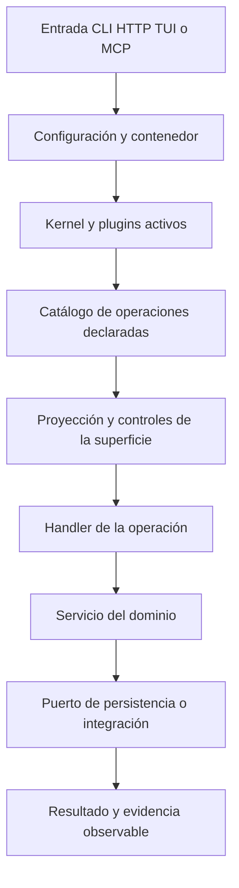

# Leer la arquitectura de una casa

**Resultado:** podrás seguir una llamada y ubicar dónde declarar, implementar, autorizar y verificar su comportamiento.

## La casa y la familia

`milpa/framework` es el template que crea tu aplicación. No es la ubicación de todas las implementaciones de Milpa. Composer instala paquetes de la familia bajo `vendor/`; la casa mantiene su configuración, sus plugins y su dominio bajo `src/`.

| Pieza | Responsabilidad principal | Pregunta que no resuelve sola |
| --- | --- | --- |
| `milpa/core` | Contratos y atributos comunes | Qué reglas tiene tu negocio |
| `milpa/container` | Resolver y registrar colaboradores | Qué servicios debes adoptar |
| `milpa/runtime` | Kernel y configuración de aplicación | Si una operación cumple su objetivo |
| `milpa/plugin` | Ciclo de vida, activación y administración | Si instalar un plugin conviene al producto |
| `milpa/command` | Operación, proveedores y contratos de efectos | Si un perfil declarado es veraz |
| `milpa/console` | Proyecciones y ejecución en superficies | Las reglas específicas del dominio |
| `milpa/app-runtime` | Capacidades de la casa, identidad y sesiones | La autoridad humana para cambiar el producto |
| `milpa/data` opcional | Entidades y repositorios básicos | Una transacción entre varias llamadas |

Son responsabilidades, no una lista de paquetes que debas instalar manualmente uno por uno. Composer resuelve las dependencias; `capabilities` enseña las adopciones opcionales que la casa reconoce.

## Del arranque a una llamada

La entrada carga el contenedor y los plugins activos; el kernel arranca esos plugins. Los plugins que implementan `CommandProvider` aportan sus operaciones. Los proveedores de paquetes declarados en `config/operations.php` aportan las suyas. Cada superficie transforma el catálogo a su forma nativa y aplica sus controles.

La declaración de una operación permite descubrirla sin ejecutarla. Su handler recibe una entrada coercionada y devuelve datos del dominio. En el taller ese handler delega al servicio; el servicio usa un repositorio. Una regla como rechazar un préstamo duplicado pertenece al servicio para que todas las superficies lleguen a la misma decisión.

La ruta exacta de controles depende de la superficie y de la configuración del host. Una sesión de agente evalúa intención y permisos; HTTP necesita la política de identidad correspondiente; la terminal verifica su autorización. Escribir `scopes` o `namedTarget` en el valor `Operation` crea un contrato que sus consumidores deben hacer valer. No equivale a colocar por sí solo middleware en cualquier controller de la aplicación.

## Declarar una capacidad

Una `Operation` incluye al menos nombre, descripción y handler. Su esquema declara entradas. `mutating` señala si modifica; el perfil de efectos describe qué clase de cambio puede hacer. `surfaces` limita dónde puede ofrecerse, `path` ayuda a la proyección HTTP y `scopes` o `permission` expresan la autorización que una política interpreta.

Los scopes y una clave semántica de permiso son alternativas en esta versión: declarar ambos está rechazado por el constructor. El ejercicio usa scopes para que la frontera de lectura sea fácil de observar. `namedTarget` identifica el argumento que selecciona un objeto existente y que el piso de intención de una sesión debe contrastar con lo pedido por el humano.

Los contratos también pueden declarar precondiciones, postcondiciones, artefactos y evidencia. Esa metadata no reemplaza el handler ni un verificador. Si declaras que una herramienta debe existir, implementa el rechazo y prueba el caso que viola esa condición.

## Arrancar sin gastar autoridad

`boot()` conecta colaboradores y declaraciones. No es el lugar para enviar mensajes, modificar datos del negocio ni depender de que una base de datos remota esté disponible. Si abrir el catálogo intenta conectar a todos los servicios, una caída externa te puede quitar justamente las herramientas para diagnosticarla.

Nuestro plugin deja `boot()` vacío y construye el repositorio cuando alguien invoca el dominio. Las operaciones se pueden listar sin leer herramientas. Eso separa descubrimiento de ejecución y hace comprobable el efecto de la lectura.

El contenedor recibe el servicio `Config` del kernel. El constructor de un plugin recibe el contenedor definido por `PluginInterface`; no agregues argumentos obligatorios arbitrarios. La configuración de valores se lee desde `Config`, con una clave del dominio como `prestamos.storage`.

## Otras entradas tienen otras fronteras

Un plugin puede contribuir rutas con `RouteProviderInterface`. Una ruta directa a un controller no pasa automáticamente por la proyección de operaciones. Si tu controller modifica el mismo estado, debe entrar al mismo servicio y tener sus propios controles de identidad y autorización. Un CRUD genérico que deja editar `prestada` podría saltarse las transiciones del taller.

Los eventos `operation.executing` y `operation.executed` permiten observar el ciclo de una operación donde el dispatcher está conectado. No convierten cualquier repositorio en un historial del negocio. Si necesitas auditoría de préstamos, diseña un registro de hechos del dominio y prueba su persistencia y atribución.

## Comprobación

Dibuja el recorrido de `herramientas.prestar`: entrada, contrato, autorización, handler, servicio, repositorio y resultado. Ubica la prueba de préstamo duplicado en el servicio y la prueba de caller sin scope en la superficie. Explica por qué ninguna de las dos sustituye a la otra.

Continúa con [capacidades y plugins](04-capacidades-y-plugins.md).
