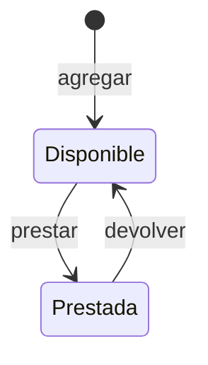

# Delimitar el dominio y la evidencia

**Resultado:** tendrás una pregunta que puede refutarse, reglas pequeñas y un orden de construcción justificado.

## Del pedido a la pregunta

El pedido «construir un sistema de préstamos» deja sin resolver quién opera, qué se presta, qué información debe perdurar y qué conflictos puede atender. Es tentador empezar por un CRUD o una pantalla. Antes de hacerlo registra esa primera intención: «iba a generar entidades y una interfaz».

La pregunta que cambia el orden para este taller es: **¿podemos representar y conservar una transición de disponibilidad que rechace el segundo préstamo de una herramienta?** Si no podemos, una interfaz atractiva no resuelve el problema. La primera construcción será el servicio y su prueba de transición; la superficie vendrá después.

Este orden expresa desarrollo guiado por doctrina y evidencia: una pregunta arquitectónica debe cambiar lo que construyes primero. No basta con agregar palabras como gobernanza a un plan que harías igual. La afirmación debe ser suficientemente pequeña para que un resultado adverso la refute.

## El primer modelo

La entidad `Herramienta` conserva `id`, `nombre` y `prestada`. Un alta crea una herramienta disponible. Un préstamo exige que exista y esté disponible; una devolución exige que exista y esté prestada. No registramos quién la toma porque las personas están fuera del primer alcance.

Una segunda llamada a `prestar` desde `Prestada` se rechaza. Una devolución desde `Disponible` también. Elegimos que esas repeticiones sean errores del dominio para que el alumno observe la precondición. Un producto diferente podría elegir devolver éxito idempotente; eso sería otra decisión, con otro contrato y otras pruebas.

No agregamos eliminación en el primer slice. Decidir qué significa borrar una herramienta prestada exigiría una regla adicional y quizá historia de préstamos. Nombrar la omisión conserva una pregunta abierta en vez de esconderla bajo un endpoint genérico.

## La afirmación y sus límites

**Hipótesis:** para un operador y llamadas secuenciales, el servicio conserva la disponibilidad entre ejecuciones y rechaza transiciones inválidas sin modificar el estado.

**Afirmación excesiva:** el taller evita todo préstamo duplicado en producción. Dos peticiones concurrentes podrían leer ambas la herramienta disponible antes de guardarla prestada. El repositorio básico no ofrece una transacción que abarque `find` y `save`. Bloquear una escritura individual no hace atómica la transición completa.

**Slice mínimo:** entidad, repositorio en memoria, servicio y pruebas de alta, préstamo, rechazo y devolución. Después repite la persistencia con repositorios de archivo creados en instancias diferentes.

**Evidencia:** la prueba muestra `ya_prestada` y compara el estado anterior con el posterior; una nueva instancia lee la herramienta prestada; una lectura de terminal en otro proceso devuelve el mismo estado.

**Diferido:** concurrencia, historial de préstamos, personas, pagos y despliegue para múltiples usuarios. La siguiente pregunta relevante será si el producto necesita una transición atómica con identidad de prestatario e historial, no qué framework de interfaz instalar.

## Los rechazos son parte del contrato

| Situación | Resultado del dominio | Lo que debes comprobar |
| --- | --- | --- |
| Nombre vacío o mayor a 120 bytes | `nombre_invalido` | No crea una fila |
| Id inexistente | `herramienta_ausente` | No inventa una herramienta |
| Prestar una disponible | Éxito con `prestada=true` | Guarda la transición |
| Prestar una ya prestada | `ya_prestada` | Conserva el estado anterior |
| Devolver una prestada | Éxito con `prestada=false` | Guarda la transición |
| Devolver una disponible | `ya_disponible` | Conserva su disponibilidad |

El límite del nombre está expresado en bytes en este ejemplo porque la implementación usa `strlen`. No lo presentes como 120 caracteres Unicode. Si tu dominio requiere un límite de caracteres, cambia la regla y su prueba de forma explícita.

Una respuesta estructurada con `ok=false` informa una negativa del negocio. Una excepción puede señalar un fallo técnico que el servicio no sabe atender. No uses excepciones indistintas para ambos casos si necesitas que la superficie explique la diferencia.

## Comprobación

Escribe estos seis elementos para tu dominio: primera intención, pregunta, hipótesis, slice, evidencia y diferidos. Pregunta si la pregunta cambió tu primer movimiento. Si no lo cambió, no lo registres como un éxito del método; busca la incertidumbre que sí ordena la construcción.

Continúa con [implementar el primer dominio](06-primer-dominio.md).
