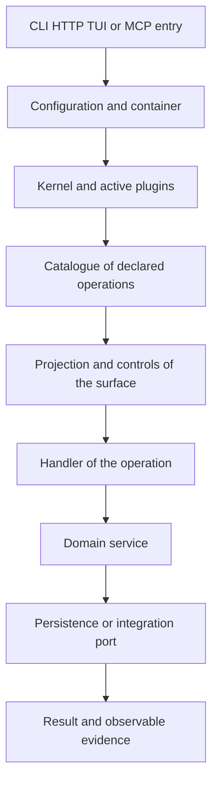

[Español](../03-arquitectura.md) · **English**

# Reading the architecture of a house

**Outcome:** you will be able to follow a call and locate where to declare, implement, authorize and verify its behaviour.

## The house and the family

`milpa/framework` is the template that creates your application. It is not where all of Milpa's implementations live. Composer installs the family's packages under `vendor/`; the house keeps its configuration, its plugins and its domain under `src/`.

| Piece | Main responsibility | Question it does not answer alone |
| --- | --- | --- |
| `milpa/core` | Common contracts and attributes | What rules your business has |
| `milpa/container` | Resolving and registering collaborators | Which services you should adopt |
| `milpa/runtime` | Kernel and application configuration | Whether an operation meets its objective |
| `milpa/plugin` | Lifecycle, activation and administration | Whether installing a plugin suits the product |
| `milpa/command` | Operation, providers and effect contracts | Whether a declared profile is truthful |
| `milpa/console` | Projections and execution on surfaces | The domain's specific rules |
| `milpa/app-runtime` | The house's capabilities, identity and sessions | The human authority to change the product |
| `milpa/data` optional | Entities and basic repositories | A transaction across several calls |

These are responsibilities, not a list of packages you must install by hand one by one. Composer resolves the dependencies; `capabilities` teaches the optional adoptions the house recognizes.

## From boot to a call

The entry loads the container and the active plugins; the kernel boots those plugins. The plugins that implement `CommandProvider` contribute their operations. The package providers declared in `config/operations.php` contribute theirs. Each surface transforms the catalogue into its native form and applies its controls.

The declaration of an operation lets it be discovered without executing it. Its handler receives a coerced input and returns domain data. In the workshop that handler delegates to the service; the service uses a repository. A rule such as rejecting a duplicate loan belongs to the service so that every surface arrives at the same decision.

The exact path of controls depends on the surface and on the host's configuration. An agent session evaluates intent and permissions; HTTP needs the corresponding identity policy; the terminal verifies its authorization. Writing `scopes` or `namedTarget` in the `Operation` value creates a contract its consumers must enforce. It is not the same as placing middleware, by itself, on any controller of the application.

## Declaring a capability

An `Operation` includes at least a name, a description and a handler. Its schema declares inputs. `mutating` signals whether it modifies; the effect profile describes what kind of change it can make. `surfaces` limits where it can be offered, `path` helps the HTTP projection and `scopes` or `permission` express the authorization a policy interprets.

Scopes and a semantic permission key are alternatives in this version: declaring both is rejected by the constructor. The exercise uses scopes so that the read boundary is easy to observe. `namedTarget` identifies the argument that selects an existing object and that a session's intent floor must contrast with what the human asked for.

Contracts can also declare preconditions, postconditions, artifacts and evidence. That metadata does not replace the handler or a verifier. If you declare that a tool must exist, implement the rejection and test the case that violates that condition.

## Booting without spending authority

`boot()` connects collaborators and declarations. It is not the place to send messages, modify business data or depend on a remote database being available. If opening the catalogue tries to connect to every service, an external outage can take away precisely the tools you need to diagnose it.

Our plugin leaves `boot()` empty and builds the repository when someone invokes the domain. The operations can be listed without reading tools. That separates discovery from execution and makes the effect of the read checkable.

The container receives the kernel's `Config` service. A plugin's constructor receives the container defined by `PluginInterface`; do not add arbitrary required arguments. Value configuration is read from `Config`, with a domain key such as `prestamos.storage`.

## Other entries have other boundaries

A plugin can contribute routes with `RouteProviderInterface`. A direct route to a controller does not automatically pass through the operation projection. If your controller modifies the same state, it must enter the same service and have its own identity and authorization controls. A generic CRUD that lets `prestada` be edited could skip the workshop's transitions.

The `operation.executing` and `operation.executed` events let you observe an operation's cycle where the dispatcher is connected. They do not turn any repository into a history of the business. If you need an audit of loans, design a record of domain facts and test its persistence and attribution.

## Checkpoint

Draw the path of `herramientas.prestar`: input, contract, authorization, handler, service, repository and result. Place the duplicate-loan test in the service and the test of a caller without scope on the surface. Explain why neither of the two replaces the other.

Continue with [capabilities and plugins](04-capacidades-y-plugins.md).
