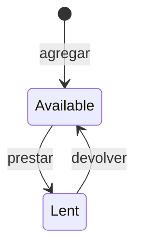

[Español](../05-dominio-y-evidencia.md) · **English**

# Bounding the domain and the evidence

**Outcome:** you will have a question that can be refuted, small rules and a justified order of construction.

## From the request to the question

The request "build a lending system" leaves unresolved who operates, what is lent, what information must last and which conflicts it can handle. It is tempting to start with a CRUD or a screen. Before doing so, record that first intention: "I was going to generate entities and an interface".

The question that changes the order for this workshop is: **can we represent and keep an availability transition that rejects the second loan of a tool?** If we cannot, an attractive interface does not solve the problem. The first thing built will be the service and its transition test; the surface will come later.

This order expresses development guided by doctrine and evidence: an architectural question must change what you build first. It is not enough to add words such as governance to a plan you would carry out the same way. The claim must be small enough for an adverse result to refute it.

## The first model

The `Herramienta` entity keeps `id`, `nombre` and `prestada`. Adding creates an available tool. A loan requires that it exists and is available; a return requires that it exists and is lent. We do not record who takes it because people are outside the first scope.

A second call to `prestar` from `Lent` is rejected. So is a return from `Available`. We chose for those repetitions to be domain errors so that the student observes the precondition. A different product could choose to return an idempotent success; that would be another decision, with another contract and other tests.

We do not add deletion in the first slice. Deciding what it means to delete a lent tool would require an additional rule and perhaps a history of loans. Naming the omission keeps a question open instead of hiding it under a generic endpoint.

## The claim and its limits

**Hypothesis:** for one operator and sequential calls, the service keeps availability between executions and rejects invalid transitions without modifying the state.

**Excessive claim:** the workshop prevents every duplicate loan in production. Two concurrent requests could both read the tool as available before saving it as lent. The basic repository does not offer a transaction that spans `find` and `save`. Locking an individual write does not make the whole transition atomic.

**Minimal slice:** entity, in-memory repository, service and tests of adding, lending, rejection and return. Then repeat persistence with file repositories created in different instances.

**Evidence:** the test shows `ya_prestada` and compares the state before with the state after; a new instance reads the lent tool; a terminal read in another process returns the same state.

**Deferred:** concurrency, loan history, people, payments and deployment for multiple users. The next relevant question will be whether the product needs an atomic transition with borrower identity and history, not which interface framework to install.

## Rejections are part of the contract

| Situation | Domain result | What you must check |
| --- | --- | --- |
| Empty name or longer than 120 bytes | `nombre_invalido` | It does not create a row |
| Non-existent id | `herramienta_ausente` | It does not invent a tool |
| Lending an available one | Success with `prestada=true` | It saves the transition |
| Lending one already lent | `ya_prestada` | It keeps the previous state |
| Returning a lent one | Success with `prestada=false` | It saves the transition |
| Returning an available one | `ya_disponible` | It keeps its availability |

The limit on the name is expressed in bytes in this example because the implementation uses `strlen`. Do not present it as 120 Unicode characters. If your domain requires a limit in characters, change the rule and its test explicitly.

A structured response with `ok=false` reports a business refusal. An exception can signal a technical failure the service does not know how to handle. Do not use exceptions indistinctly for both cases if you need the surface to explain the difference.

## Checkpoint

Write these six elements for your domain: first intention, question, hypothesis, slice, evidence and deferred items. Ask whether the question changed your first move. If it did not, do not record it as a success of the method; look for the uncertainty that does order the construction.

Continue with [implementing the first domain](06-primer-dominio.md).
